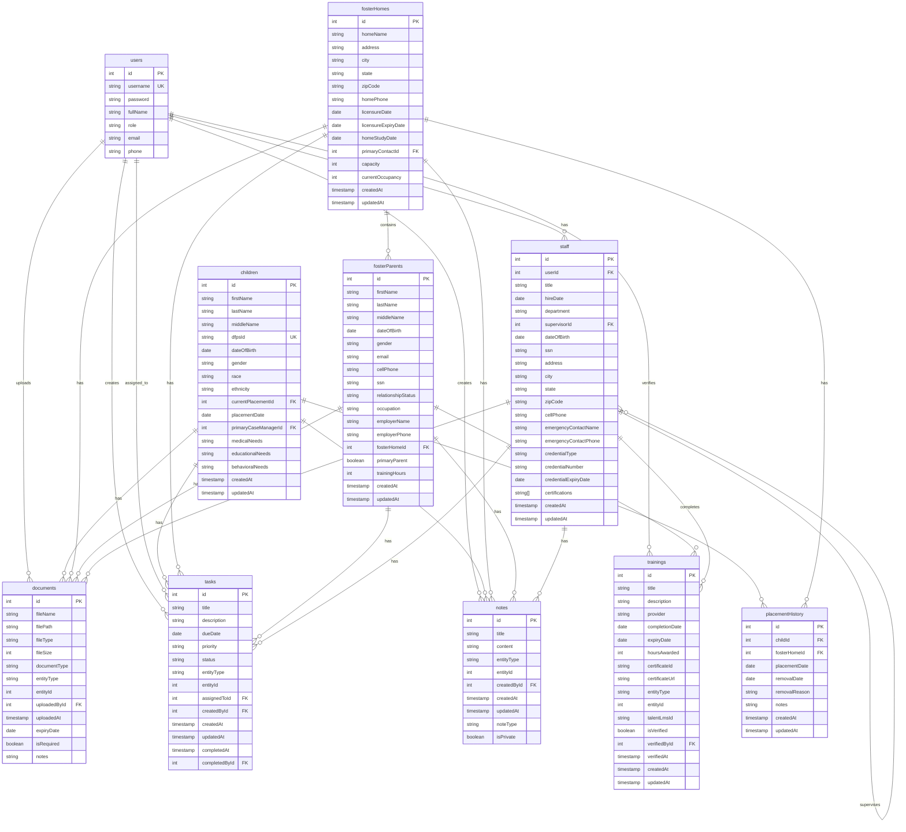

# Foster Care Management System - Entity Relationship Diagram

## Schema Notes

1. **Entity Types**: For entities like documents, notes, trainings, and tasks, the `entityType` field indicates which entity (child, foster parent, staff, foster home) the record is associated with, and `entityId` points to that entity's ID.

2. **User Relationships**: Users can be staff members, create tasks, upload documents, and verify trainings.

3. **Key Relationships**:
   - Children are placed in foster homes (tracked in placement history)
   - Foster parents belong to foster homes
   - Staff can supervise other staff members
   - Each entity can have documents, notes, and tasks associated with it
   - Foster parents and staff complete trainings

4. **Audit Trails**: Most tables include creation and update timestamps, as well as user IDs for who created or modified records.